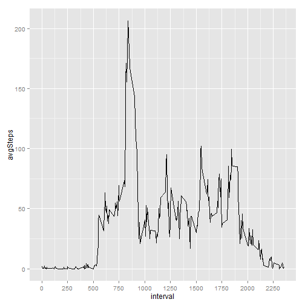
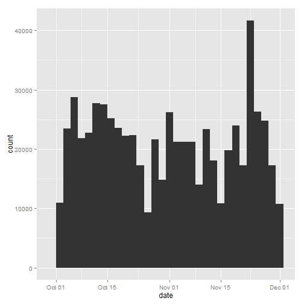
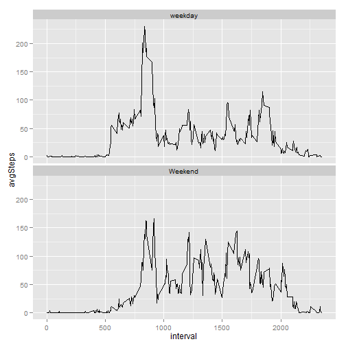

# Reproducible Research Peer Assessment 1
==========================================

Chart plotting will be done using ggplot2

Import ggplot2 library

```r
library(ggplot2)
```

```
## Warning: package 'ggplot2' was built under R version 3.0.3
```


Import data and re-format date column from factor class to date class

```r
data <- read.csv("activity.csv")
data$date <- as.Date(data$date, "%Y-%m-%d")
```


Calculate mean and median total number of steps taken per day. Missing values are ignored.

```r
mean(data$steps, na.rm = TRUE)
```

```
## [1] 37.38
```

```r
median(data$steps, na.rm = TRUE)
```

```
## [1] 0
```


Create a data frame that contains average daily steps by interval and plot average daily steps vs interval

```r
stepInterval <- by(data$steps, data$interval, mean, na.rm = TRUE)
stepInterval <- data.frame(interval = as.numeric(names(stepInterval)), avgSteps = as.numeric(stepInterval))
ggplot(aes(x = interval, y = avgSteps), data = stepInterval) + geom_line() + scale_x_continuous(breaks = seq(0, 2500, 250))
```

 


Calculate the interval with highest average daily steps


```r
with(stepInterval, interval[which(avgSteps == max(avgSteps))])
```

```
## [1] 835
```


Calculate the number of NA rows in each column and since only steps column has NA values, the number of rows with NA is equal to the number of NA step observations, 2304 rows.


```r
naRows <- data.frame(steps = sum(is.na(data$steps)), date = sum(is.na(data$date)), interval = sum(is.na(data$interval)))
naRows
```

```
##   steps date interval
## 1  2304    0        0
```


Fill in NA steps observation with the mean steps of the same interval


```r
naStepIndex <- which(is.na(data$steps))
naStepInterval <- data$interval[naStepIndex]
for (i in 1: length(naStepIndex)) {
    data$steps[naStepIndex[i]] <- stepInterval$avgSteps[stepInterval$interval == naStepInterval[i]]
}
```


Plot a histogram of total number of steps taken daily. The impact of imputing is higher total daily step count compared to just leaving NAs observation alone.


```r
ggplot(aes(x = date, weight = steps), data = data) + geom_histogram()
```

```
## stat_bin: binwidth defaulted to range/30. Use 'binwidth = x' to adjust this.
```

 


Calculate new mean and median of total number of steps. No difference in the value of mean and median compared to first part of the assignment.


```r
mean(data$steps)
```

```
## [1] 37.38
```

```r
median(data$steps)
```

```
## [1] 0
```

Create a new factor variable to indicate "weekday" vs "weekend"


```r
data$dayType <- ifelse(weekdays(data$date) == "Saturday" | weekdays(data$date) == "Sunday", "Weekend", "Weekday")
```

Create time series average daily steps vs interval separated by weekend or weekday


```r
weekdayData <- data[data$dayType == "Weekday", ]
weekendData <- data[data$dayType == "Weekend", ]
weekendStepInterval <- by(weekendData$steps, weekendData$interval, mean)
weekendStepInterval <- data.frame(interval = as.numeric(names(weekendStepInterval)), avgSteps = as.numeric(weekendStepInterval))
weekdayStepInterval <- by(weekdayData$steps, weekdayData$interval, mean)
weekdayStepInterval <- data.frame(interval = as.numeric(names(weekdayStepInterval)), avgSteps = as.numeric(weekdayStepInterval))
weekendStepInterval$dayType <- "Weekend"
weekdayStepInterval$dayType <- "weekday"
wholeWeekStepInterval <- rbind(weekendStepInterval, weekdayStepInterval)
ggplot(aes(x = interval, y = avgSteps), data = wholeWeekStepInterval) + geom_line() + facet_wrap(~dayType, ncol = 1)
```

 

